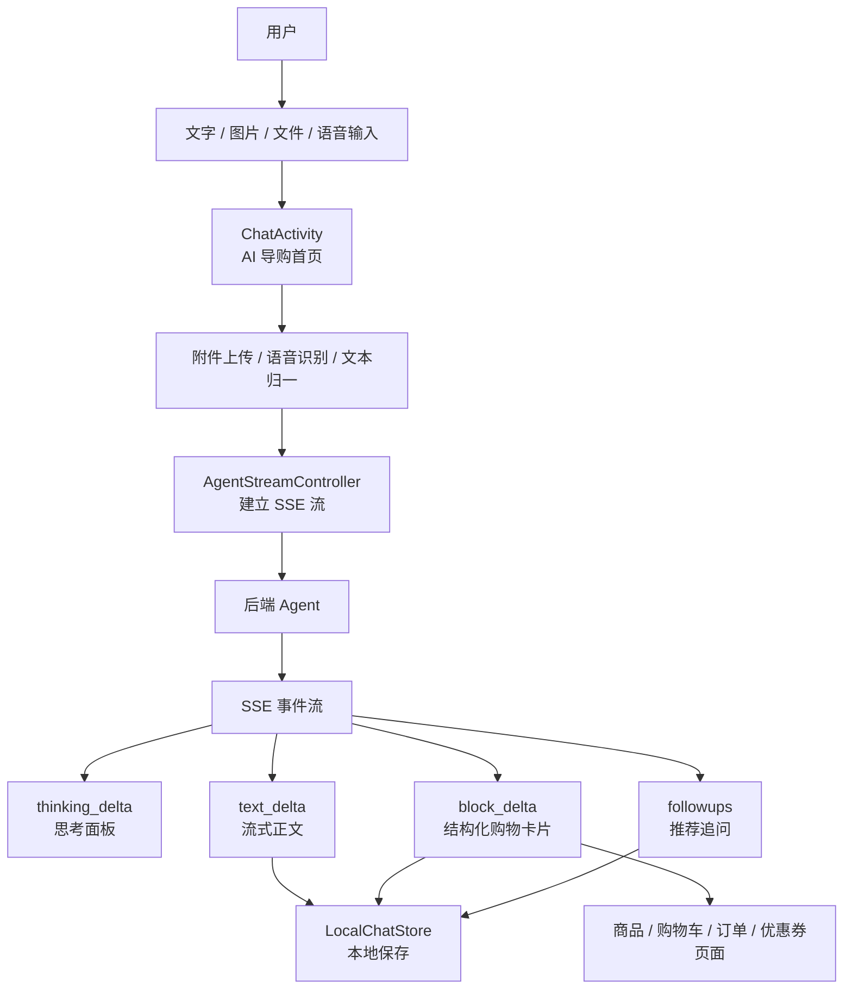
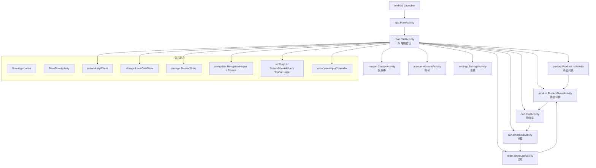
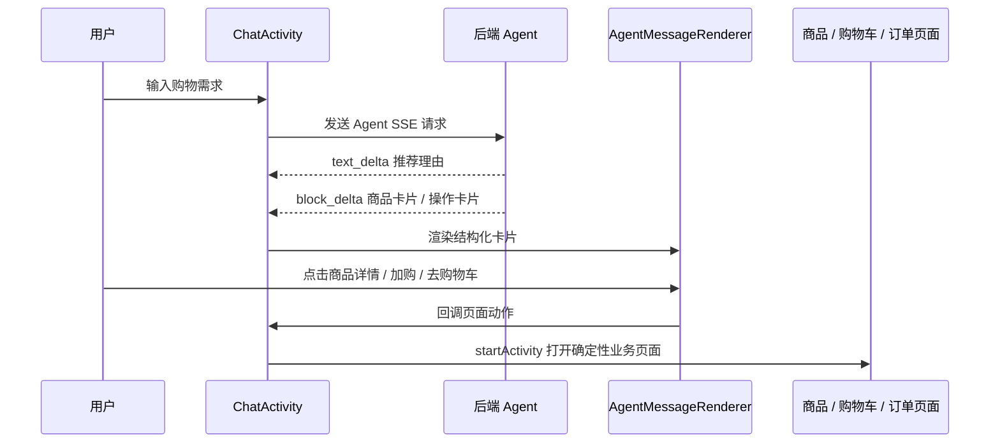
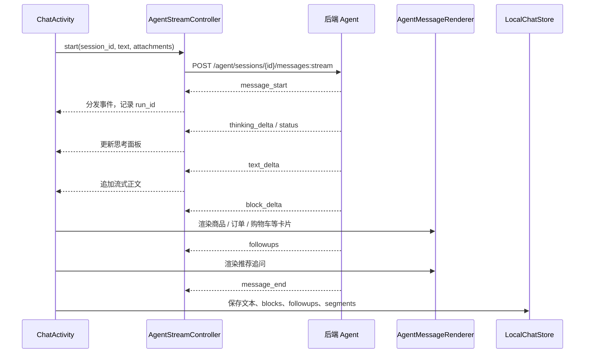
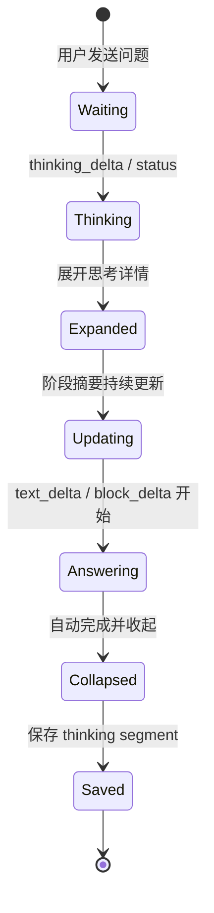
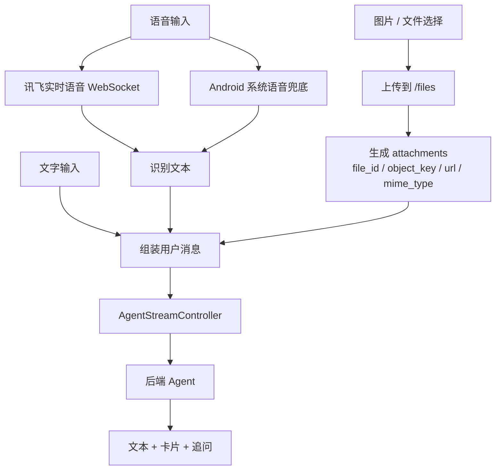
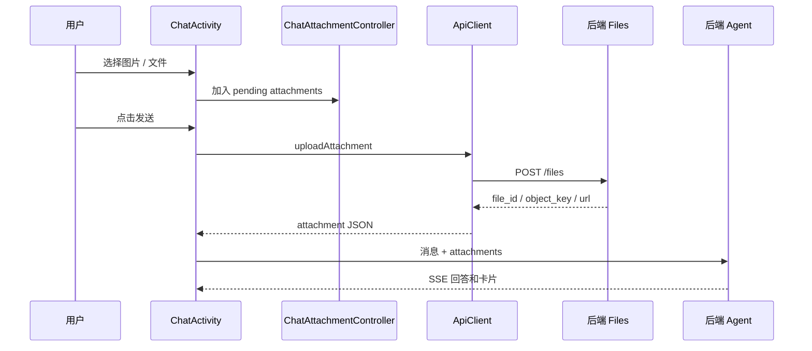
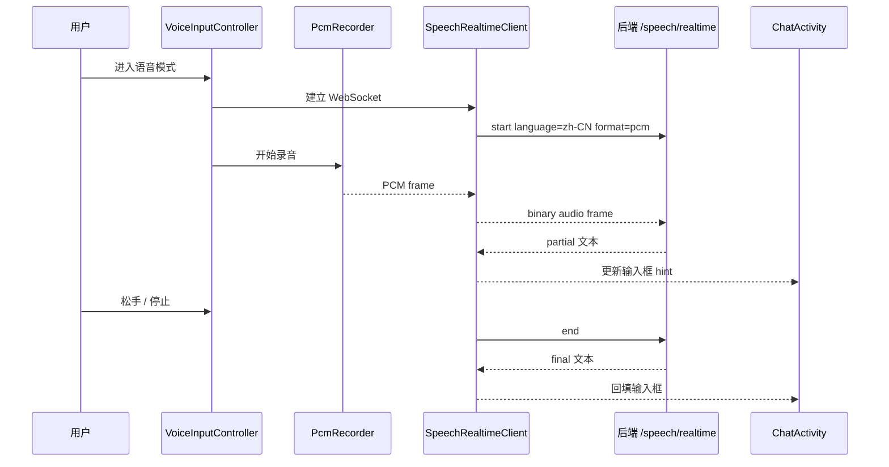

# 4. 关键设计决策

## 4.1 客户端交互

为了适配 AI 导购场景，客户端不能只是简单展示一下大模型回答，还需要承担“导购入口、流式反馈、结构化购物 UI、多模态输入、电商页面承接”等职责。

因此，客户端交互层的核心设计目标是：**让用户能从自然语言需求顺畅进入真实购物链路，同时在等待 AI 生成时获得足够明确的过程反馈。**

这和普通聊天机器人的客户端不同。普通聊天客户端只要把用户问题发给服务端，再把回答展示出来即可；而电商 AI 导购客户端还要解决三个问题：

1. **AI 结果如何承接真实购物动作**  
   用户看到推荐后，下一步通常不是继续看文字，而是查看商品详情、加入购物车、领取优惠券、结算、查看订单。

2. **AI 生成过程如何被用户理解**  
   导购回答可能需要经历需求分析、商品检索、知识库查询、结果总结。若客户端只显示一个“正在生成”，用户会感觉等待过程不可控。

3. **用户如何低成本表达购物需求**  
   电商场景中，用户不一定愿意打长文本。图片找同款、语音描述预算和场景，都是更自然的输入方式。

客户端整体交互链路如下：



当前 Android 客户端采用 Java 原生实现，页面拆分为多 Activity，并按模块分包。`ChatActivity` 是 AI 导购首页，`ProductListActivity`、`ProductDetailActivity`、`CartActivity`、`CheckoutActivity`、`OrderListActivity`、`CouponActivity` 等传统电商页面继续承担确定性操作。

```text
android-native/app/src/main/java/com/xzxg/shop
├── chat        AI 导购聊天、SSE、思考过程、附件、历史会话
├── product     商品列表、商品详情、SKU、评价、加购
├── cart        购物车、结算确认、下单草稿
├── order       订单列表、支付、取消、确认收货、评价
├── coupon      优惠券
├── account     登录注册、账号管理、个人资料
├── settings    设置、帮助、关于、高级设置
├── network     REST、SSE、附件上传
├── storage     登录态、本地聊天会话和消息缓存
├── ui          通用 UI、图片加载、Markdown、底部弹窗、顶部栏
└── voice       讯飞实时语音、Android 系统语音兜底
```

## 4.1.1 AI 导购与传统电商页面协同

AI 导购 = 独立聊天页 + 电商 APP 的新入口，同时在侧栏保留传统的界面入口。用户可以在 AI 导购页完成需求表达、商品理解和决策辅助，传统电商页面也能继续承担商品浏览、详情确认、购物车管理、结算、订单和账号等确定性操作。

### 开发小故事其一：只做聊天框还是接入完整电商页面？

在客户端设计初期，曾考虑把 AI 导购做成一个相对独立的聊天页面，只负责发送问题和展示回答。

这个方案实现成本最低，但很快暴露出问题：AI 推荐出的商品如果不能直接被点击、加购和结算，用户仍然需要回到商品列表手动搜索；AI 只是在“建议”用户购买，而没有真正进入购物链路。

因此，当前方案选择让 `ChatActivity` 成为 AI 导购入口，但不把所有交易操作都塞进聊天页。聊天页负责需求理解、推荐解释、对比辅助和入口分发；传统电商页面负责商品详情、购物车、结算、订单等确定性操作。

这形成了一种更适合电商导购的客户端分工：

```text
AI 聊天页：降低决策成本
传统电商页：完成确认和交易
```

### 安卓 APP 整体架构

当前客户端已经从早期的“大量页面逻辑集中在 MainActivity”拆分为“多 Activity + 按模块分包”的结构。



这一结构的关键点是：`MainActivity` 只承担应用入口和转发职责，真正的业务页面由各自 Activity 承担。这样做的收益是客户端交互逻辑更加清晰，不同业务页面可以独立维护，不再把商品、购物车、订单、账号、设置和 AI 导购全部堆在一个巨大 Activity 中。

### 为什么 AI 导购不能只停留在聊天页？

电商导购的最终目标不是“聊完”，而是辅助用户完成购物决策。聊天页适合自然表达需求，但不适合承载所有交易细节。

例如用户问：

```text
我想买一款适合油皮、价格别太贵的洗面奶。
```

AI 可以在聊天页完成：

- 分析用户肤质、预算、价格敏感度。
- 检索商品和知识库。
- 输出推荐理由。
- 展示商品卡片。
- 给出后续追问。

但用户真正决定购买时，还需要：

- 查看商品详情和评价。
- 确认 SKU、价格、库存。
- 加入购物车。
- 修改数量和勾选状态。
- 试算优惠。
- 提交订单。
- 支付、确认收货、评价。

这些动作更适合由传统电商页面承接。因此当前方案没有把聊天页设计成“万能页面”，而是把它设计成“导购大厅”：负责把用户从模糊需求带到明确商品和明确动作。

### 页面协同方式

客户端中，`ChatActivity` 和传统页面之间主要通过三类方式协同：

| 协同方式 | 说明 | 关键实现 |
| --- | --- | --- |
| 结构化商品卡片 | AI 返回商品卡后，用户可以直接查看商品详情或加入购物车 | `AgentMessageRenderer`、`ProductDetailActivity`、`api.addCartItem` |
| 页面入口跳转 | AI 或侧栏返回导航 action，客户端跳转到购物车、订单、商品、优惠券等页面 | `navigateRoute`、`NavigationHelper`、`Routes` |
| 本地状态承接 | 页面跳转前保存当前流式回答和会话状态，避免切页导致回答丢失 | `LocalChatStore`、`persistAndCancelActiveStreamForNavigation` |

协同链路如下：



### 调整前后对比

| 维度 | 调整前 | 调整后 | 提升 |
| --- | --- | --- | --- |
| 产品形态 | AI 页面偏独立聊天框 | AI 导购作为电商 APP 入口 | 购物链路连续性↑ |
| 用户操作 | 推荐后需要自行找商品入口 | 商品卡片可直接详情 / 加购 / 跳转 | 操作路径↓ |
| 页面职责 | 聊天页承载过多业务，页面边界不清 | 聊天负责决策，业务页负责确认和交易 | 职责清晰度↑ |
| 代码结构 | 早期大量逻辑集中在 `MainActivity` | 多 Activity + 按模块分包 | 可维护性↑ |
| 后续扩展 | 新页面容易继续堆逻辑 | 通过路由和独立 Activity 承接 | 扩展成本↓ |

### 小结

这一设计的核心不是“加一个 AI 聊天页”，而是把 AI 导购放到电商链路的入口位置。AI 负责帮助用户从模糊需求走向明确选择，传统页面负责承接更严肃的交易动作。这样既保留了对话式导购的自然体验，又没有牺牲电商交易流程的确定性。

## 4.1.2 流式输出与渲染协议

客户端没有把后端 SSE 当成简单的文本流，而是设计成“过程反馈 + 正文流式 + 结构化卡片 + 追问建议”的渲染协议。这使得用户既能实时看到 AI 正在做什么，也能在正式回答生成过程中逐步看到内容和可操作卡片。

### 开发小故事其二：纯文本流式输出不够用

在初期设计中，最简单的方式是让后端只返回一个文本流，客户端像普通聊天软件一样逐字追加展示。

但这个方案很快遇到问题：电商导购的回答并不只有正文。它还包含商品卡、商品对比表、购物车状态、订单摘要、优惠明细、优惠券列表、评价摘要、售后规则和页面跳转动作。

如果这些信息全部混在 Markdown 文本中，会带来三个问题：

1. 客户端难以把商品和操作按钮稳定渲染出来。
2. 用户无法直接从回答进入详情、加购、订单等页面。
3. 历史消息恢复时，只能恢复一段文字，无法恢复完整购物 UI。

因此当前方案将 SSE 输出拆分为多种事件：正文用 `text_delta`，思考过程用 `thinking_delta`，结构化购物内容用 `block_delta`，推荐追问用 `followups`。

### SSE 渲染协议

当前客户端将后端 SSE 事件理解为一个完整的回答生命周期：



SSE 事件职责如下：

| SSE 事件 | 客户端处理 | 体验价值 |
| --- | --- | --- |
| `message_start` | 初始化一次回答，记录 `run_id` | 后续可取消生成、追踪本次 Agent Run |
| `status` / `thinking_status` | 转成思考阶段文本 | 即使没有完整 thinking_delta，也能给用户过程反馈 |
| `thinking_delta` | 更新思考面板中的阶段、摘要、候选商品 | 让用户看到“分析用户需求 / 查询商品与资料 / 总结答案” |
| `text_delta` | 追加正式回答正文 | 正文逐步出现，降低等待感 |
| `content_delta` | 兼容旧结构化内容事件 | 保持协议演进兼容性 |
| `block_delta` | 渲染商品卡、订单卡、购物车卡、优惠券卡等 | 把回答变成可操作购物 UI |
| `followups` | 渲染后续追问按钮 | 引导用户继续决策 |
| `message_end` | 完成收尾并保存本地消息 | 形成完整历史记录 |
| `error` | 展示失败、取消或风控提示 | 异常状态可感知、可恢复 |

### 客户端分工

当前客户端将流式渲染拆成多个类协作，避免 `ChatActivity` 承担所有细节。

| 类 | 职责 |
| --- | --- |
| `ApiClient` | 封装 `/messages:stream` 请求，读取 SSE `data:` 行并转成 JSON 事件 |
| `AgentStreamController` | 创建远程会话、生成 `client_message_id`、管理当前请求、取消请求、分发事件 |
| `ChatActivity` | 管理聊天 UI 状态，处理 SSE 事件，维护当前 assistant 草稿 |
| `AgentMessageRenderer` | 渲染商品卡、对比表、订单卡、购物车卡、优惠券卡、评价摘要等 |
| `ChatMarkdownRenderer` | 处理 Markdown、表格、文本复制和基础富文本 |
| `LocalChatStore` | 保存本地会话、消息、附件、blocks、followups、thinking segments |

`AgentStreamController` 的设计重点是把“网络流”和“页面状态”隔开。它会记录当前请求 ID、当前本地会话、当前远程会话和当前 run_id。若用户切换会话、取消生成或页面跳转，旧事件会被忽略，避免串流到错误会话。

### 思考过程面板

在导购场景中，用户等待的不只是文本生成，还包括检索和分析。因此客户端专门设计了思考过程面板。

思考面板的阶段可以概括为：

```text
分析用户需求
  -> 查询商品与资料
  -> 总结答案
```

当后端发送 `thinking_delta` 或 `status` 时，客户端会更新对应阶段。正式回答开始，也就是收到 `text_delta` 或 `block_delta` 后，客户端会将思考过程标记完成，并自动收起思考面板。



这个设计有两个价值：

1. **降低等待焦虑**  
   用户能看到系统不是卡住，而是在分析需求、查询资料和组织答案。

2. **增强导购可信度**  
   思考过程让用户感受到回答不是凭空生成，而是经过了检索和整理。

客户端还做了两点细节优化：

- 展开和收起思考详情时使用高度和透明度动画，避免页面突然跳动。
- 如果正式回答先于完整思考事件返回，客户端会启动兜底思考时间线，保证体验不空白。

### 结构化购物卡片

纯文本无法承载完整电商交互。因此后端通过 `block_delta` 返回结构化内容，客户端通过 `AgentMessageRenderer` 渲染成卡片。

当前可渲染的典型内容包括：

| 卡片类型 | 作用 |
| --- | --- |
| 商品卡片 | 展示商品图、名称、价格、卖点，并支持详情和加购 |
| 商品对比表 | 多商品横向比较，适合决策型问题 |
| 引用来源卡片 | 展示知识库或资料来源 |
| 购物车状态卡片 | 展示当前购物车商品和应付金额 |
| 订单摘要卡片 | 展示下单结果和订单状态 |
| 优惠明细卡片 | 展示商品总额、优惠金额、应付金额 |
| 优惠券卡片 | 展示可领券或已领券 |
| 评价摘要卡片 | 展示评分、评价数量和代表性评价 |
| 售后规则卡片 | 展示售后政策和下一步说明 |
| 导航动作卡片 | 引导用户跳转商品、购物车、订单、优惠券等页面 |

结构化卡片的关键价值在于：**AI 输出不再只是“解释”，而变成了可点击、可确认、可继续交易的购物界面。**

### 历史消息恢复

流式回答结束后，客户端不会只保存最终文本，而是会保存：

- 正文内容 `content`
- 结构化卡片 `blocks_json`
- 推荐追问 `followups_json`
- 思考过程 `segments_json`
- 附件信息 `attachments_json`

这样用户从历史会话进入时，不只能看到文字，还能恢复当时的商品卡、追问和思考过程。

这点对 AI 导购尤其重要。因为一个会话往往对应一个购物任务，用户可能隔一段时间后回来看之前推荐过的商品和对比结果。只保存文本会让历史记录失去大量购物上下文。

### 调整前后对比

| 维度 | 调整前 | 调整后 | 提升 |
| --- | --- | --- | --- |
| 输出协议 | 单一文本流 | 多事件 SSE 协议 | 表达能力↑ |
| 等待体验 | 用户只看到“生成中” | 实时展示思考阶段 | 过程透明度↑ |
| 商品展示 | 文本描述商品 | 商品卡片 / 对比表 / 评价卡片 | 决策效率↑ |
| 业务动作 | 用户自行寻找入口 | 卡片可直接详情 / 加购 / 跳转 | 操作成本↓ |
| 历史恢复 | 只保存文本 | 保存文本、卡片、追问、思考段 | 会话完整性↑ |
| 异常处理 | 流中断后难以定位 | 区分取消、鉴权、风控、普通失败 | 可恢复性↑ |

### 小结

流式输出与渲染协议的关键决策是：**不要把所有内容压成一段 Markdown，而是把 AI 回答拆成适合客户端理解的事件。**

`text_delta` 负责让正文实时出现，`thinking_delta` 负责解释过程，`block_delta` 负责承载电商结构化 UI，`followups` 负责引导下一步决策。这样客户端既保留了对话式体验，也具备了电商页面所需的可操作性。

## 4.1.3 多模态交互

电商导购的需求表达不只有文字。真实购物中，用户可能拍照找同款、上传图片让 AI 识别风格，也可能直接语音描述需求。因此客户端把文字、图片 / 文件附件、实时语音统一放到同一条 Agent 消息链路中。

### 开发小故事其三：为什么不只做文本输入？

只支持文本输入时，用户需要把商品外观、风格、场景用语言完整描述出来，表达成本很高。

但电商导购里有大量天然适合图片和语音的场景：

- 用户看到一件衣服，想找类似款。
- 用户拍了商品包装，想找同款或替代品。
- 用户在路上不方便打字，只想语音说预算和用途。
- 用户想上传图片后继续追问“这个风格再便宜点有没有”。

因此，客户端增加了图片 / 文件附件和语音输入，并把它们统一接入 Agent 消息流。这样多模态不是独立功能，而是和导购上下文、思考过程、商品卡片、追问一起进入同一个交互闭环。

### 多模态输入总链路



### 文字输入

文字输入是最基础链路。用户输入自然语言后，客户端会：

1. 读取输入框文本。
2. 获取当前会话 ID。
3. 保存用户消息到本地。
4. 如果本地会话还没有绑定后端会话，则先创建远程会话。
5. 调用 `/agent/sessions/{session_id}/messages:stream` 建立 SSE。
6. 实时渲染后端返回的思考、正文、卡片和追问。

链路如下：

```text
用户输入文字
  -> ChatActivity
  -> LocalChatStore 保存用户消息
  -> AgentStreamController 创建或复用远程 session
  -> ApiClient.streamMessage
  -> 后端 Agent SSE
  -> ChatActivity 渲染回答
```

### 图片 / 文件输入

图片和文件通过 `ChatAttachmentController` 管理待发送附件，通过 `ApiClient.uploadAttachment` 上传到后端 `/files`。

附件上传时，客户端会做基础校验：

- 附件不能为空。
- 单个附件不能超过 10MB。
- 上传失败时保留输入内容，并提示用户重试。
- 上传过程中显示“正在上传 x/y”“上传完成”等状态。

上传成功后，后端返回文件信息，客户端将其转换为 Agent 可理解的 attachment JSON，随用户消息一起发送。



如果用户上传图片并表达“找同款 / 找相似商品”，后端可根据附件信息调用图片向量检索工具 `search_image_products`，返回相似商品候选。客户端不需要单独维护一套“图片搜索页面”，而是仍然通过 AI 导购聊天流展示结果。

### 语音输入

语音输入由 `VoiceInputController` 统一管理，当前包含两条路径：

1. **讯飞实时语音识别**  
   使用 `SpeechRealtimeClient` 建立 WebSocket，`PcmRecorder` 录制 PCM 音频帧并持续发送到后端 `/speech/realtime`。

2. **Android 系统语音识别兜底**  
   当实时语音不可用、网络失败或设备不支持时，客户端会降级到 Android 系统语音识别。

实时语音链路如下：



语音输入没有绕开 Agent 链路。识别出的文本会回填输入框，用户确认后仍然通过普通消息发送到 Agent。这样语音只是降低输入成本，不会破坏后端风控、记忆、意图分类、工具调用等统一链路。

### 为什么统一进入 Agent 消息链路？

多模态输入有两种设计方式：

1. 每种输入方式走独立功能链路。
2. 所有输入统一组装成 Agent 消息。

当前项目选择第二种。原因是：

1. **上下文一致**  
   图片、语音、文字都进入同一个会话，后续用户可以继续追问“第二个”“这个风格”“刚才那张图”。

2. **风控和记忆复用**  
   后端不需要为图片、语音单独实现另一套风控、记忆、意图路由和工具策略。

3. **输出协议复用**  
   多模态输入最终仍然通过 `thinking_delta`、`text_delta`、`block_delta` 和 `followups` 输出，客户端渲染逻辑保持一致。

4. **异常处理更简单**  
   附件上传失败、语音识别失败可以在输入阶段处理；一旦消息发送成功，后续就进入统一 Agent 流式链路。

### 调整前后对比

| 维度 | 调整前 | 调整后 | 提升 |
| --- | --- | --- | --- |
| 输入方式 | 仅文字输入 | 文字 + 图片 / 文件 + 语音 | 表达自然度↑ |
| 图片需求 | 用户必须口头描述外观 | 上传图片后可图片搜同款 | 商品发现效率↑ |
| 语音需求 | 用户需要手动打字 | 实时语音识别 + 系统兜底 | 移动端易用性↑ |
| 后端链路 | 不同输入可能割裂 | 多模态统一进入 Agent 消息 | 链路一致性↑ |
| 异常处理 | 单一路径失败即中断 | 上传校验、大小限制、语音兜底 | 稳定性↑ |

### 小结

多模态交互的核心决策是：**把图片和语音当作用户表达需求的补充方式，而不是独立于导购链路之外的功能。**

文字、图片、文件、语音最终都会被统一组装成一条 Agent 消息，进入同一套风控、记忆、意图分类、工具调用和流式渲染链路。这样既降低了用户表达成本，又保持了系统架构的一致性。

## 4.1 小结

客户端交互层的设计重点，是把 AI 的不确定生成能力和电商 APP 的确定性操作链路连接起来。

在入口设计上，AI 导购页负责需求表达和决策辅助，商品、购物车、订单等页面负责确认和交易；在输出协议上，SSE 被拆分为思考、正文、卡片和追问；在输入方式上，文字、图片、语音统一进入 Agent 消息链路。

这样客户端既保留了对话式导购的自然体验，又没有牺牲电商交易所需的清晰路径和稳定交互。
