# 安卓 APP 模块架构图

更新时间：2026-06-08

代码范围：`/Users/leo/xzxg-shop/android-native`

## 1. 当前架构定位

`android-native` 是小猪小狗电商 AI 导购系统的 Java 原生 Android 客户端。当前已经从早期的“所有页面集中在 `MainActivity`”拆分为“多 Activity + 按模块分包”的结构。

当前 Android 端的核心特点：

- 入口层由 `app.MainActivity` 负责转发到聊天主页。
- 业务页面已经按模块拆成独立 Activity，例如聊天、商品、购物车、结算、订单、账号、设置等。
- 公共能力按职责进入 `network`、`storage`、`ui`、`navigation`、`voice` 等共享包。
- 页面仍然采用 Java 手写 Android View，不使用 XML layout、Fragment、Jetpack Compose 或 Navigation Component。
- 网络层仍由 `ApiClient` 统一封装 REST、附件上传和 Agent SSE。
- 本地存储仍由 `SessionStore` 和 `LocalChatStore` 负责。

## 2. Android 工程结构

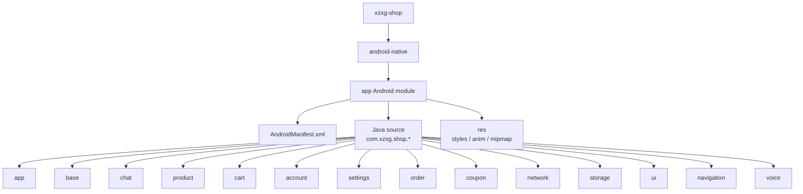

## 3. 分包结构

当前 Java 源码目录：

```text
android-native/app/src/main/java/com/xzxg/shop
├── account
│   ├── AccountActivity.java
│   ├── AccountSessionHelper.java
│   ├── AccountUi.java
│   ├── AvatarPreviewActivity.java
│   ├── EditProfileActivity.java
│   └── LoginActivity.java
├── app
│   ├── MainActivity.java
│   └── ShopApplication.java
├── base
│   └── BaseShopActivity.java
├── cart
│   ├── CartActivity.java
│   ├── CheckoutActivity.java
│   └── CheckoutDraftStore.java
├── chat
│   ├── AgentMessageRenderer.java
│   ├── AgentStreamController.java
│   ├── ChatActivity.java
│   ├── ChatAttachmentController.java
│   ├── ChatHistoryDrawer.java
│   └── ChatMarkdownRenderer.java
├── coupon
│   └── CouponActivity.java
├── navigation
│   ├── NavigationHelper.java
│   └── Routes.java
├── network
│   └── ApiClient.java
├── order
│   └── OrderListActivity.java
├── product
│   ├── ProductDetailActivity.java
│   └── ProductListActivity.java
├── settings
│   ├── AboutActivity.java
│   ├── AdvancedSettingsActivity.java
│   ├── HelpActivity.java
│   └── SettingsActivity.java
├── storage
│   ├── LocalChatStore.java
│   └── SessionStore.java
├── ui
│   ├── BottomSheetHelper.java
│   ├── CircleImageView.java
│   ├── ImageLoader.java
│   ├── MarkdownRenderer.java
│   ├── ShopUi.java
│   └── TopBarHelper.java
└── voice
    ├── PcmRecorder.java
    ├── SpeechRealtimeClient.java
    └── VoiceInputController.java
```

## 4. 模块职责

| 包 | 主要职责 | 关键类 |
| --- | --- | --- |
| `app` | 应用入口、全局单例对象 | `MainActivity`、`ShopApplication` |
| `base` | Activity 公共基类、系统栏、Toast、公共依赖入口 | `BaseShopActivity` |
| `chat` | AI 导购聊天、SSE、思考过程、附件、历史会话、Agent 内容渲染 | `ChatActivity`、`AgentStreamController`、`AgentMessageRenderer` |
| `product` | 商品列表、搜索、分类、活动页、商品详情、SKU、评价、加购 | `ProductListActivity`、`ProductDetailActivity` |
| `cart` | 购物车、勾选、数量修改、删除、结算确认、下单草稿 | `CartActivity`、`CheckoutActivity`、`CheckoutDraftStore` |
| `order` | 订单列表、支付、取消、确认收货、评价 | `OrderListActivity` |
| `coupon` | 可领优惠券、我的优惠券、领取优惠券 | `CouponActivity` |
| `account` | 登录注册、账号管理、个人资料、头像预览和编辑 | `LoginActivity`、`AccountActivity`、`EditProfileActivity` |
| `settings` | 我的、帮助、关于、高级设置、退出登录 | `SettingsActivity`、`AdvancedSettingsActivity` |
| `network` | REST、SSE、附件上传、接口异常封装 | `ApiClient` |
| `storage` | 登录态、本地聊天会话和消息缓存 | `SessionStore`、`LocalChatStore` |
| `ui` | 通用 UI 组件、图片加载、Markdown 渲染、底部弹窗、顶部栏 | `ShopUi`、`TopBarHelper`、`BottomSheetHelper` |
| `navigation` | 路由常量和跨 Activity 跳转适配 | `Routes`、`NavigationHelper` |
| `voice` | 语音输入、讯飞实时语音、Android 系统语音兜底 | `VoiceInputController`、`SpeechRealtimeClient`、`PcmRecorder` |

## 5. Activity 架构图

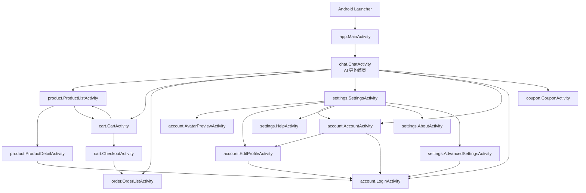

## 6. 运行时分层

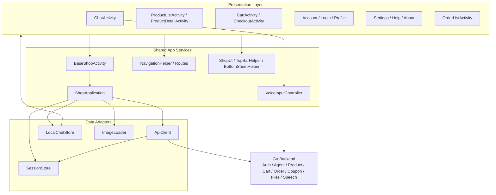

说明：

- `BaseShopActivity` 暴露 `sessionStore()`、`localChatStore()`、`api()`、`imageLoader()` 等公共入口，业务 Activity 不直接创建这些对象。
- `ShopApplication` 持有进程级单例，避免各页面重复初始化网络、存储和图片加载器。
- `NavigationHelper` 使用分包后的完整 Activity 路径，例如 `.chat.ChatActivity`、`.product.ProductListActivity`。
- `ApiClient` 仍是统一网络适配器，业务模块通过它访问后端。

## 7. Manifest 注册

`AndroidManifest.xml` 已按分包后的类名注册：

```text
application: .app.ShopApplication
launcher:    .app.MainActivity

activities:
.chat.ChatActivity
.product.ProductListActivity
.product.ProductDetailActivity
.cart.CartActivity
.cart.CheckoutActivity
.order.OrderListActivity
.coupon.CouponActivity
.account.LoginActivity
.account.AccountActivity
.account.EditProfileActivity
.account.AvatarPreviewActivity
.settings.SettingsActivity
.settings.AdvancedSettingsActivity
.settings.HelpActivity
.settings.AboutActivity
```

权限：

- `INTERNET`：访问后端 API、图片、SSE 和语音服务。
- `RECORD_AUDIO`：实时语音输入和系统语音识别。

## 8. 启动流程

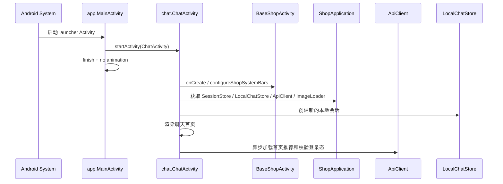

启动后默认进入 `ChatActivity`，这是用户端的主工作台。`MainActivity` 只保留入口转发职责。

## 9. AI 导购聊天流程

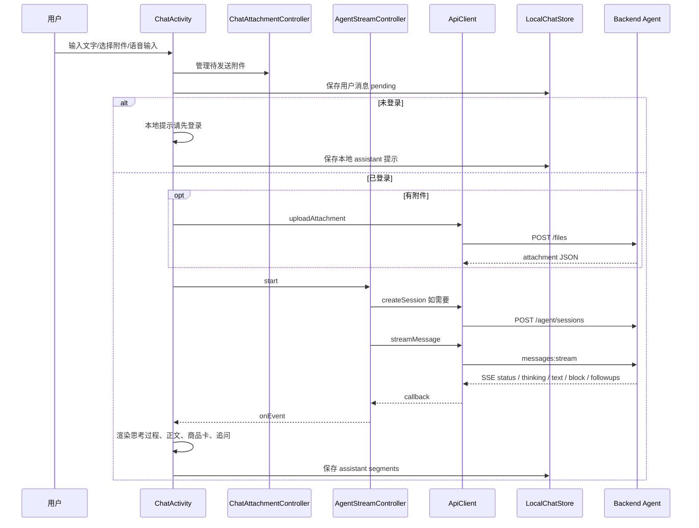

关键类分工：

- `ChatActivity`：页面状态、输入栏、消息列表、思考面板、历史回放、跨页面导航。
- `AgentStreamController`：Agent 会话创建、SSE 流启动、取消、流式生命周期回调。
- `AgentMessageRenderer`：商品卡、购物车状态、订单摘要、优惠券、评价摘要、政策卡片等结构化内容。
- `ChatMarkdownRenderer` / `MarkdownRenderer`：Markdown、表格、文本片段渲染。
- `ChatAttachmentController`：图片和文件附件选择、预览、上传状态管理。
- `ChatHistoryDrawer`：历史会话分页、搜索、远端同步状态和滚动位置。

## 10. 思考过程渲染流程

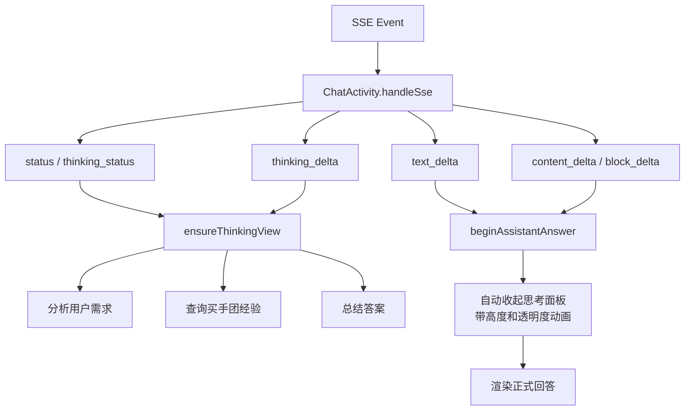

当前思考面板支持：

- 后端流式输出 `分析用户需求`、`查询买手团经验`、`总结答案`。
- 用户手动展开/收起，带动画。
- AI 正式回答开始后自动收起，自动收起也带动画。
- 历史消息回放时从 `segments_json` 恢复思考过程。

## 11. 商品和购物车流程

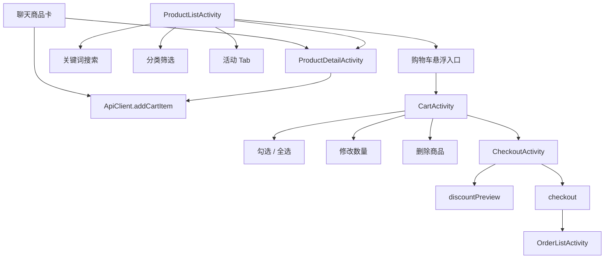

分工：

- `ProductListActivity`：商品列表、分页加载、关键词搜索、分类选择、活动页、购物车悬浮数量角标。
- `ProductDetailActivity`：商品主图、价格、SKU、卖点、参数、评价、加入购物车。
- `CartActivity`：购物车列表、选择、数量变更、删除、合计金额、进入结算。
- `CheckoutActivity`：商品清单、金额明细、优惠试算、提交订单。
- `CheckoutDraftStore`：结算页短期内存草稿，避免通过 Intent 传递大 JSON。

## 12. 订单、优惠券和账号流程

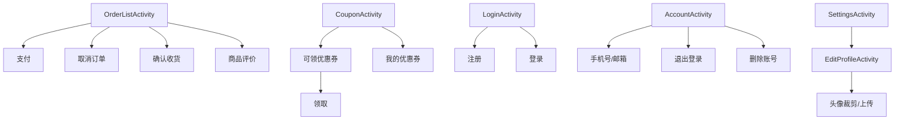

说明：

- 订单模块只放 `OrderListActivity`，订单状态操作都通过 `ApiClient` 调后端。
- 优惠券从账号或聊天路由进入 `CouponActivity`。
- 账号资料相关页面统一在 `account` 包内，设置页只做入口和偏好设置。

## 13. 语音输入流程

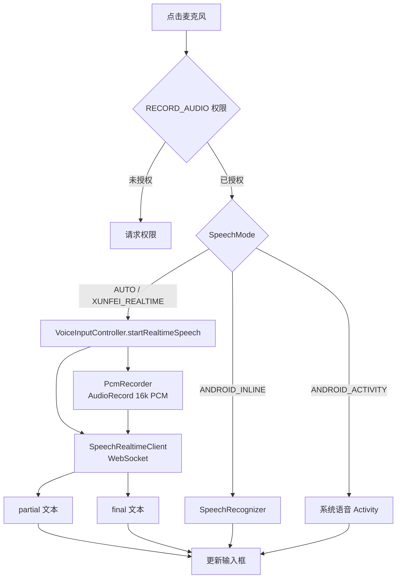

`voice` 包只负责语音识别能力，识别结果回填输入框仍由 `ChatActivity` 控制。

## 14. 本地存储

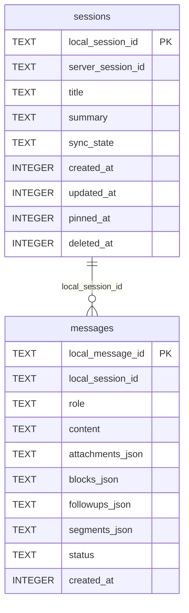

`SessionStore` 保存：

- `token`
- `role`
- `nickname`
- `avatar_url`
- `account_id`
- `username`
- `phone`
- `email`
- 测试后端地址
- 侧栏是否显示“返回聊天”

`LocalChatStore` 保存：

- 本地会话和远端会话绑定关系。
- 用户消息、assistant 消息、附件、结构化块、追问、思考过程。
- 历史会话搜索、分页、置顶、重命名、软删除和同步状态。

## 15. 网络能力映射

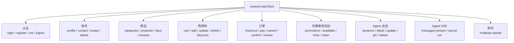

实现特点：

- REST 使用 `HttpURLConnection`。
- SSE 使用 `HttpURLConnection` 读取 `data:` 行并解析 JSON。
- 附件上传支持 byte array 和 `InputStream`。
- 语音 WebSocket 由 `SpeechRealtimeClient` 负责，不放在 `ApiClient` 内。

## 16. 当前架构优点和后续建议

已完成的改善：

- `MainActivity` 不再承载所有页面，入口职责被压缩到启动转发。
- 商品、购物车、结算、订单、账号、设置等页面都有独立 Activity。
- 共享能力已经按模块分包，文件定位更清晰。
- Manifest 和 `NavigationHelper` 已适配分包后的 Activity 路径。

仍需注意：

- `ChatActivity` 仍然较大，后续可以继续拆成 `ChatComposerView`、`ThinkingRenderer`、`ChatSessionController` 等更小单元。
- 当前仍是手写 View 架构，没有 ViewModel/Repository，异步状态主要靠 Activity 字段维护。
- `ApiClient` 仍聚合所有后端接口，后续可以按 `AuthApi`、`ProductApi`、`CartApi`、`AgentApi` 继续拆。
- 业务线程主要使用 `new Thread` + `runOnUiThread`，后续可统一封装任务执行器。

## 17. 验证记录

分包完成后已执行：

```text
bash ./gradlew :app:assembleDebug
```

结果：编译通过。

已安装并通过新入口启动：

```text
com.xzxg.shop/.app.MainActivity
```

日志检查未发现：

- `FATAL EXCEPTION`
- `ClassNotFoundException`
- `ActivityNotFoundException`
