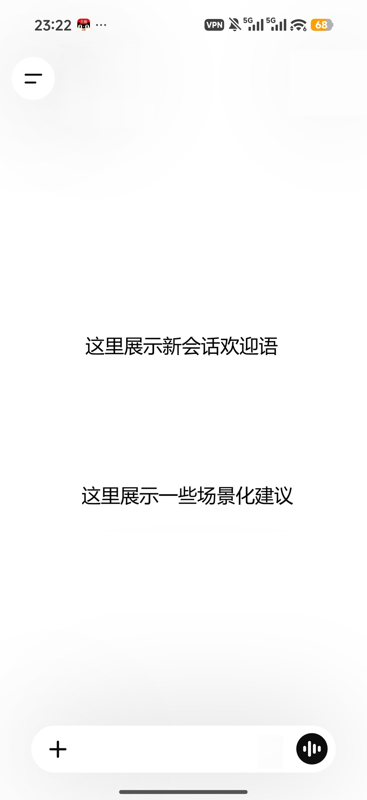
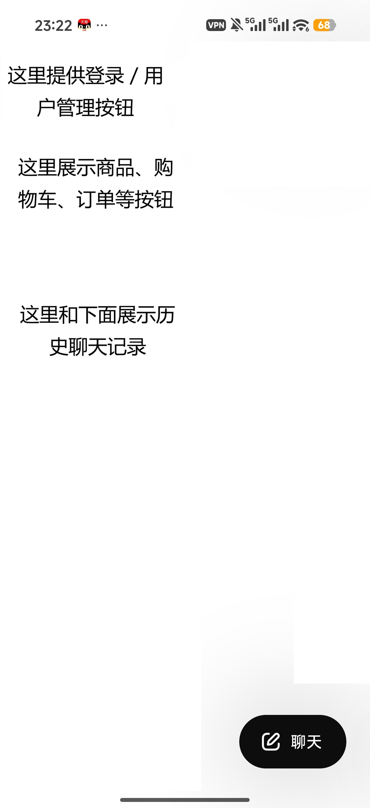

## 顾客端的设计

1. 在 “3.3 聊天页交互” 里，顶部左侧可以设计一个侧栏按钮，点开了之后会打开侧栏。

2. 在 “3.3 聊天页交互” 里，底部不仅要支持输入区，支持文字输入、图片入口、发送/停止按钮，还要支持语音输入，至于语音如何转文字，还需要未来的进一步设计。

3. 在 “3.3 聊天页交互” 里，首屏提出的新会话欢迎语和几个场景化建议应当由后端给出，不能随便设计。现在后端还没有设计这部分，你可以先写一个空的占位。

4. 主页的聊天页面可以参考如下图片：

  - 首页的中间写欢迎语。
  - 如果登录了的话，下面就可以给出一些场景化建议；如果没登录，就不给出这部分，并给出类似 “登录以提供个性化建议” 的建议。
  - 顶部左上角有一个侧栏按钮，点开就可以展示侧栏。
  - 下面是文字输入框，左边的加号用于添加图片，右边的语音按钮用于语音转文字。

5. 侧栏可以参考如下图片：

  - 左侧最上面提供用户管理按钮。
    - 如果用户没登录，那么直接显示登录按钮，点进去是登录页面。
    - 如果用户登陆了，那么显示用户的头像和昵称，点进去是类似于 “我的” 这样的用户管理页面。
    - 请你自己设计用户管理系统，能够实现注册、登录、修改用户信息等功能。
  - 左侧中间分别展示“商品”、“购物车”、“订单”等按钮，点击则跳转到对应页面。
  - 左侧下面展示历史聊天记录，点击则加载对应聊天记录并跳转回对应的聊天页面。
  - 右下角的 “聊天” 按钮点击之后返回现在的主页聊天页面。

6. 其余页面请你参考已有的 APP 自行设计，要求**风格现代且统一**，且**页面设计美观**。

## 其余角色的页面设计

请你参考 Web 页面，将其余角色所需的功能移植到 Android APP 中。