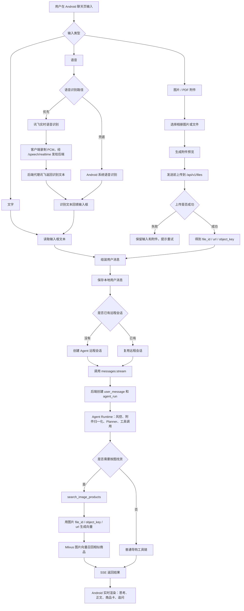

# Android APP 多模态输入流程图

下面流程以当前代码实现为准，概括 Android 导购聊天中 **文字、图片 / PDF 附件、语音** 三类输入如何统一进入 Agent 消息链路。

简要说明：

- 文字输入直接进入普通消息发送链路。
- 图片和 PDF 会先上传到 `/api/v1/files`，聊天消息里只携带附件元信息。
- 语音先转成文本并回填输入框，用户确认后仍按普通文本消息发送。
- 图片找同款不是客户端直接完成，而是 Agent 在后端工具链中调用 `search_image_products`。
- 最终结果通过 SSE 流式返回，Android 端按事件渲染正文、商品卡和追问。
