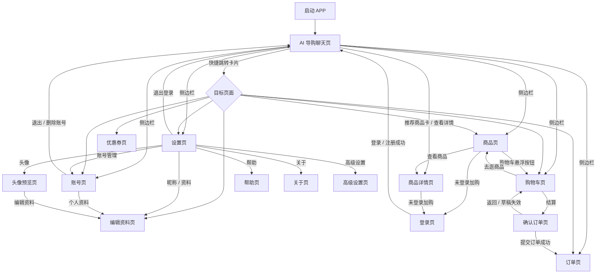

# Android APP 页面跳转流程图

下面是按当前 Android APP 代码梳理后的简版页面跳转关系。图中只使用中文页面名称，不展开代码实现细节。

简要说明：

- APP 启动后默认进入 **AI 导购聊天页**。
- 聊天页是主入口，负责侧边栏跳转、商品卡详情跳转、后端快捷跳转卡片跳转。
- 商品、购物车、订单、设置、账号是主要一级页面。
- 设置页下面还有资料、头像、帮助、关于、高级设置等二级页面。
- 需要登录的页面或动作会先跳到登录页，登录成功后回到聊天页。
